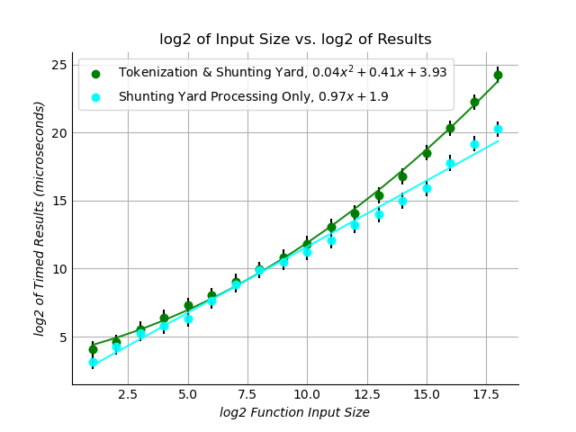
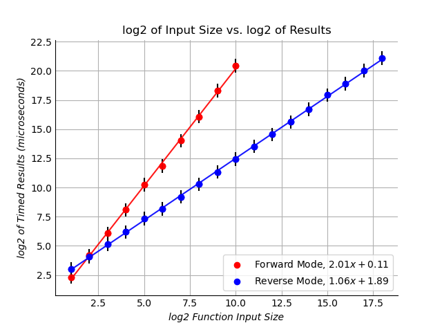

--- 
affiliations: 
  - 
    index: 1
    name: "Software Engineering Master's Degree Candidate, Harvard University, Extension School"
  - 
    index: 2
    name: "Computer Science Major, Harvard College"
  - 
    index: 3
    name: "Lecturer on Computational Science, Harvard Institute for Applied Computational Science"
  - 
    index: 4
    name: "Post-Doctoral Associate, MIT Lincoln Laboratory"
authors: 
  - 
    affiliation: 1
    name: "Neil Warren^[Footnote description.]"
    orcid: 0000-0001-7848-4226
  - 
    affiliation: 2
    name: "Aakash Mishra^[Footnote description.]"
    orcid: ~
  - 
    affiliation: 3
    name: "David Sondak^[Footnote description.]"
    orcid: ~
  - 
    affiliation: 4
    name: "Andrew Kirby^[Footnote description.]"
    orcid: ~
bibliography: paper.bib
date: "03 11 2021"
tags: 
  - "automatic differentiation"
  - "algorithmic differentiation"
title: "Mishra-Warren Autodiff: A Generalized Input Automatic Differentiation library in C++"

---

# Summary

From mathematical optimization to the training of neural networks, the need to efficiently compute  derivatives of complex functions of tens or even thousands of variables and operations has become ubiquitous in the field of machine learning.  [@JMLR:v18:17-468]  Given the computational drawbacks of performing symbolic differentiation, which quickly becomes intractable with moderate functional complexity for even the most sophisticated computer algebra systems, automatic differentiation has become the preferred method of derivative computation.  Notably, several popular open source machine learning libraries include automatic differentiation functionality: Pytorch [@paszke2017automatic], [@pytorch]; Tensorflow [@TFAutodiff].  While powerful and extensible, these libraries are limited in the scope and form of the input that they can accept.  In particular, users of these libraries use computer source code (often Python) to input the function to be differentiated or write source code to derive the internal representation of the functions.  For functions derived outside of the Python environment, or from an otherwise inaccessible computational environment, function definition and data input is a largely manual process.  

The Mishra-Warren Autodiff library utilizes forms of generalized input (i.e., non-specific to the computational environment), such as scientific documents and text strings. Accepting more generalized forms of input allows for the efficient automation of automatic differentiation for functions derived in varied computational environments.  This is particularly useful for large functions of tens or even thousands of variables, for example, as provided by output in text form from documents or as output from libraries written in other languages with incompatible data types. 

# Statement of need

In many applications, scientists may use a software library that lacks built-in efficient automatic differentiation functionality to a generate complex function with many variables and need to efficiently calculate the derivative or a series of derivatives of the function.  For large functions of tens or even thousands of variables, the data input process for providing that function to a standard machine learning library such as Pytorch or Tensorflow can be exceedingly time consuming and prone to error.  Thus, there is a need for an automatic differentiation library that can read in the function to be evaluated in a generalized form, such as a raw text, that can be easily written out to a file by an external software library. 

Mishra-Warren Autodiff is a C++ library that applies Dijkstra's shunting yard algorithm [@boysen2012shunting] to pre-process textual function inputs along with point vectors and derivative seed vectors, and then applies forward and reverse mode automatic differentiation algorithms to develop a well-formed Jacobian matrix. In contrast, most existing popular automatic differentiation libraries take functional input in the form of a computer program's source code (often Python) utilizing specialized data structures and previously declared variables and constants. [@TFAutodiff] This makes the process of applying automatic differentiation to functions from textual sources a manual task. Mishra-Warren Autodiff accepts raw textual input, e.g., "f(x0,y0) = x0 * cos(y0)," from the command line or a text file, such as a scientific document. 

# Features 
Mishra-Warren Autodiff takes as input functional descriptions and provides as output a complete well-formed Jacobian matrix.  The user may optionally select either forward mode or reverse mode automatic differentiation, the relative advantages and disadvantages of which have been discussed at length in the literature. [@DBLP:journals/corr/abs-1811-05031] [@JMLR:v18:17-468]

As shown in \autoref{fig:Parsing}, the Mishra-Warren Autodiff shunting yard pre-processing implementation achieves approximately O(n) time complexity over the number of generated tokens (approximately proportional to the number of elementary functions in the input function).  This was confirmed using a standard laptop with an Intel® Core™ i7-8550U CPU running 100 averaged trials with functions of up to 524,288 elementary operations and independent variables. Independent of the functional complexity, given that variable names given in text (e.g., “x0,” "x1," ... “x524287”) grow in length, parsing for variable names in the tokenizer causes the shape of the curve to become more quadratic as the input size is increases. 

Given the algorithmic constraints of forward mode automatic differentiation, which computes partial derivatives for each independent variable at each computational node, reverse mode provides for more efficient computation of derivatives for functions with a large numbers of independent variables.  Reverse mode, in contrast, requires the computation of an adjoint tree from a first pass through the function tokens, which adds a small amount of computational overhead and thus is not optimal for functions of on a few variables.  An exemplary description of computational time complexity for the parsing and evaluation of the Jacobian for functions of 1 to $2^{18}$ variables is provided below. 

# Acknowledgements

Mishra-Warren Autodiff was developed as an extension of a group project developed in the course "Systems Development for Computational Science," CS-107, at Harvard University in the Fall of 2020 under the instruction of Dr. David Sondak, Harvard Institute for Applied Computational Science, and Dr. Andrew Kirby, Post-doctoral associate at MIT Lincoln Laboratory, and in collaboration with Leo Landau and Samson Negassi. 

# References

